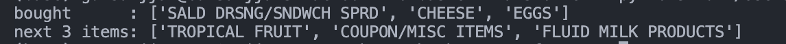

# 🛒 Basket Transformer

*A lightweight, educational GPT-2 model for predicting the next grocery product in a basket.*

  
  

---

## 🎯 Project Overview

This project explores the application of transformer models to predict the next product in a grocery basket. It serves as an educational exercise to understand how transformer architectures can be adapted to real-world sequential data. The model is trained on a subset of the Dunnhumby dataset, containing 2 million baskets and 92,341 unique products.

---

## 🧠 Technical Details

### Data Preparation
The dataset consists of 2 million baskets, each containing a sequence of product IDs. The product IDs are tokenized into a vocabulary of 92,341 unique tokens. Each basket is converted into a sequence of product IDs, with a maximum length of 50 tokens.

### Model Architecture
The model is a 4-layer GPT-2 transformer with the following configuration:
- **Embedding Dimension**: 128
- **Number of Heads**: 4
- **Number of Layers**: 4
- **Dropout Rate**: 0.1
- **Batch Size**: 32
- **Learning Rate**: 3e-4

The model is trained to predict the next product in the sequence, using cross-entropy loss on the last token of each sequence.

### Training Process
The model is trained for one epoch on a MacBook Pro M2, taking approximately 20 minutes. The training process involves the following steps:
1. **Data Loading**: The dataset is loaded and split into training and validation sets.
2. **Model Initialization**: The GPT-2 model is initialized with the specified configuration.
3. **Training Loop**: The model is trained using the AdamW optimizer and cross-entropy loss. The training loop includes forward pass, loss computation, backward pass, and weight update.
4. **Validation**: The model's performance is evaluated on the validation set after each epoch.

### Results
After training, the model achieves a top-3 accuracy of approximately 9%, indicating reasonable learning. Here's a sample prediction:

bought      : ['SALAD DRESSING', 'CHEESE', 'EGGS']
next 3 items: ['TROPICAL FRUIT', 'COUPON', 'FLUID MILK']

  
*Sample prediction result*
